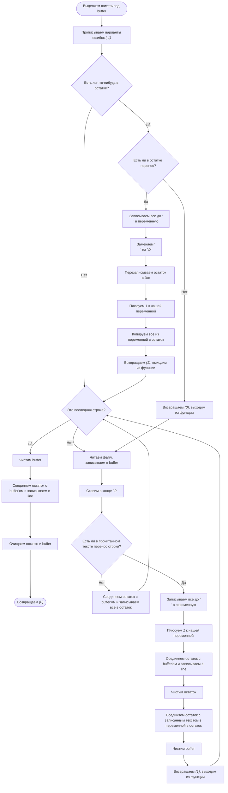

<!--  -->

```mermaid
  graph TD;
      A([Выделяем память под buffer])-->a["Прописываем варианты ошибок <i>(-1)</i>"];
      a-->B{Есть ли что-нибудь в остатке?};
      B--Нет-->C{Это последняя строка?};
      B--Да-->E{Есть ли в остатке перенос?};
      C--Да-->c[Чистим buffer]-->c1[Соединяем остаток с buffer'ом и записываем в line]-->c2[Очищаем остаток и buffer]-->c3(["Возвращаем <i>(0)</i>"]);
      C--Нет-->c4[Читаем файл, записываем в buffer]-->c5[Ставим в конце <i>'\0'</i>]-->D{Есть ли в прочитанном тексте перенос строки?};
      D--Нет-->d[Соединяем остаток с buffer'ом и записываем все в остаток]-->C;
      D--Да-->d1[Записываем все до <i>'\n'</i> в переменную]-->d2[Плюсуем <i>1</i> к нашей переменной]-->d3[Соединяем остаток с buffer'ом и записываем в line]-->d4[Чистим остаток]-->d5[Соединяем остаток с записанным текстом в переменной в остаток]-->d6[Чистим buffer]-->d7["Возвращаем <i>(1)</i>, выходим из функции"]-->C;
      E--Нет-->e["Возвращаем <i>(0)</i>, выходим из функции"]-->c4;
      E--Да-->e1[Записываем все до <i>'\n'</i> в переменную]-->e2[Заменяем '\n' на '\0']-->e3[Перезаписываем остаток в <i>line</i>]-->e4[Плюсуем <i>1</i> к нашей переменной]-->e5[Копируем все из переменной в остаток]-->e6["Возвращаем <i>(1)</i>, выходим из функции"]-->C;
```
